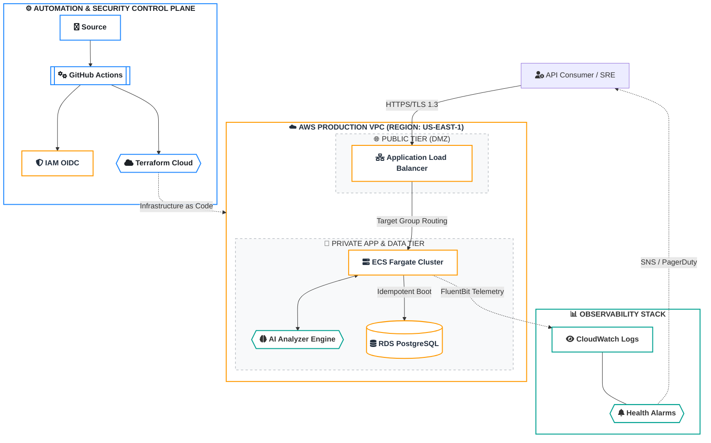
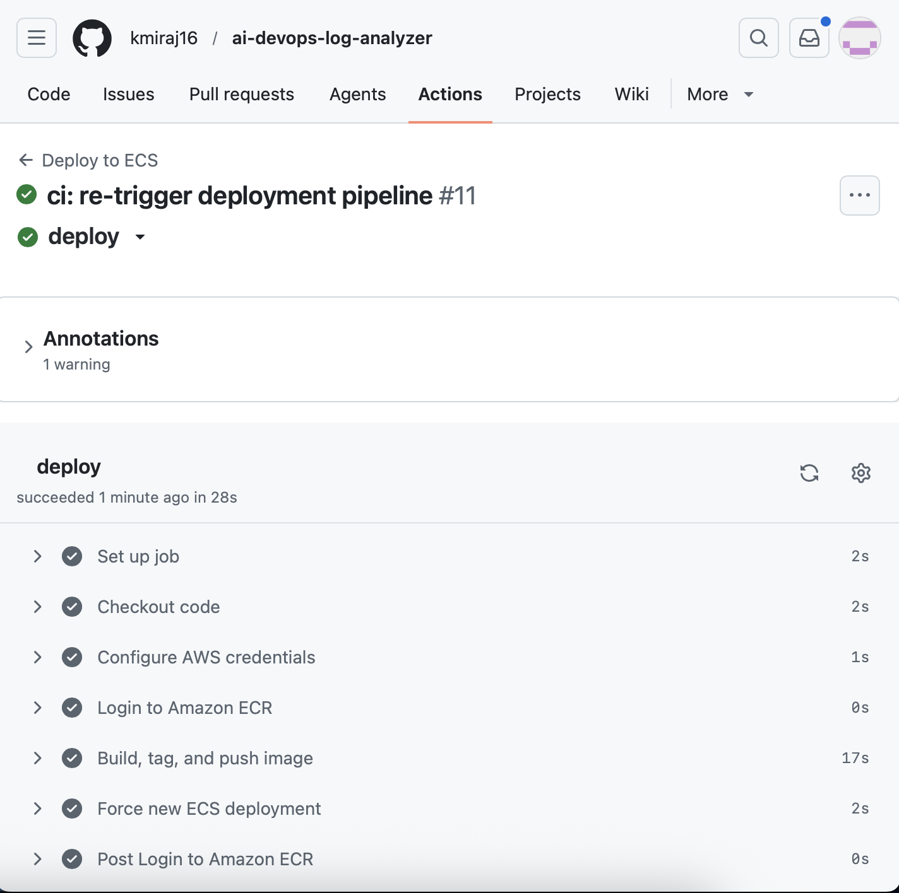
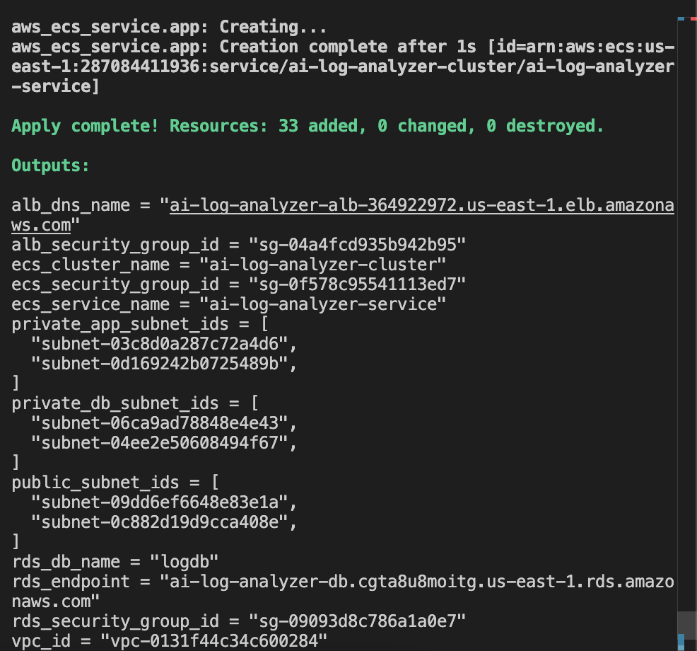
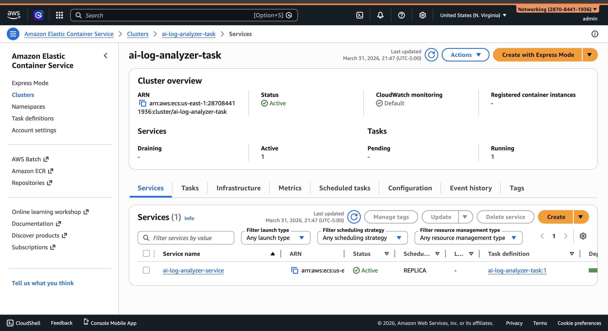
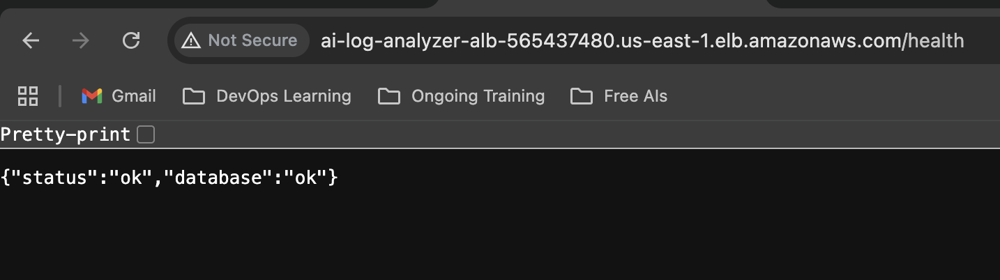
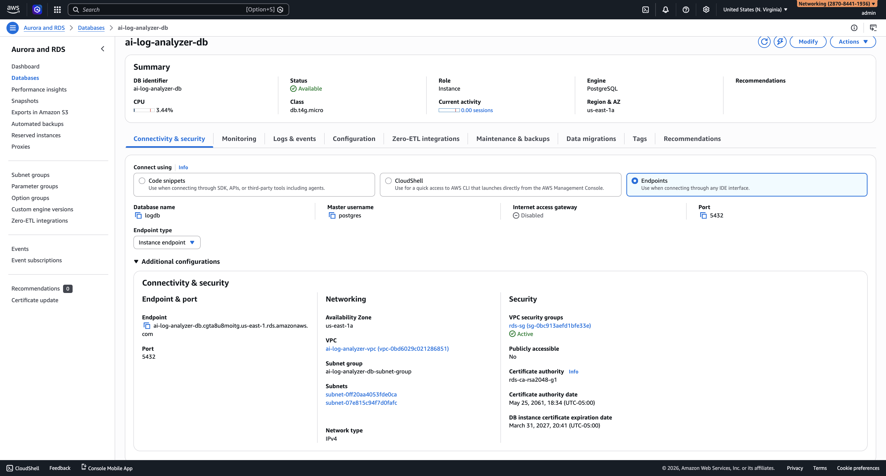
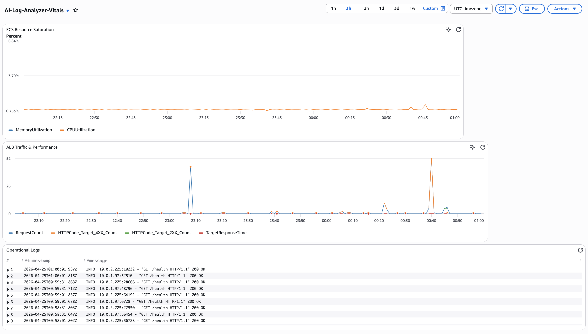
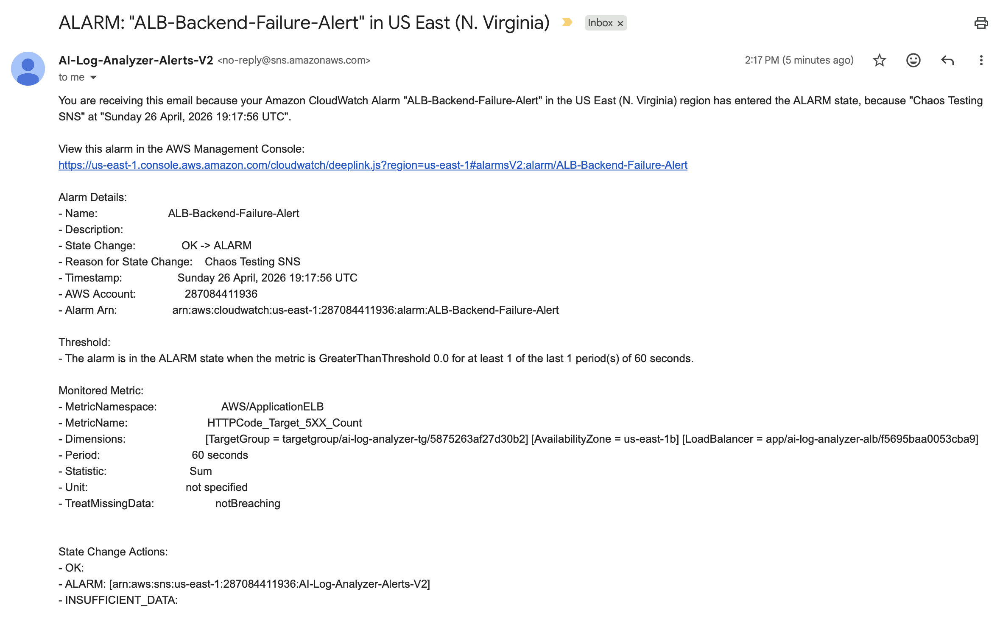

# AI DevOps Log Analyzer 🚀

[](https://aws.amazon.com/)
[](https://www.terraform.io/)
[](https://fastapi.tiangolo.com/)
[](https://www.docker.com/)
[](https://github.com/features/actions)

An enterprise-grade observability platform designed to reduce **Mean Time to Detection (MTTD)**. This system ingests distributed logs, utilizes a specialized **AI-driven root cause engine**, and automates multi-tier infrastructure orchestration via a hardened CI/CD pipeline.

---

## 🏗️ Enterprise Cloud-Native Architecture



---

## ⚙️ Core Engineering Capabilities

### 🛡️ Zero-Trust CI/CD & Security
* **OIDC Identity Federation:** Eliminated the use of long-lived AWS IAM Access Keys. GitHub Actions authenticates via **OpenID Connect (OIDC)** short-lived tokens.
* **Multi-Tier Network Isolation:** Engineered a hardened VPC with **Public (DMZ)** and **Private** tiers. Compute (ECS) and Database (RDS) reside in non-routable subnets.

### 🤖 AI-Powered Reliability
* **Automated Root Cause Analysis:** Log streams are processed by an AI engine to provide immediate remediation runbooks, significantly reducing **MTTR**.
* **Idempotent Schema Orchestration:** The app manages its own RDS schema lifecycle migrations during container instantiation.

### 📊 Observability & Monitoring
* **Centralized Logging:** Integrated CloudWatch Log Insights for real-time FastAPI application log analysis.
* **Infrastructure Dashboards:** Custom CloudWatch Dashboards monitoring ECS Fargate CPU/Memory saturation and ALB latency percentiles.
* **Proactive Alerting:** Automated SNS email alerts triggered by CloudWatch Alarms for 5XX backend failures and database connection thresholds.
* **Operational Readiness:** Comprehensive SRE Runbook detailing smoke tests, rollback procedures, and chaos testing validation.

---

## 📡 Operational Proof & Validation

<details>
<summary><b>1. Automated Pipeline Execution (CI/CD)</b></summary>
<br>
<b>Artifact:</b> <code>screenshots/local/workflows.png</code>
<br>
<b>Technical Significance:</b> Validates the full CI/CD lifecycle (Linting -> Docker Build -> ECR Push -> ECS Deployment). This proves the project is not manually deployed but managed through 100% automated workflows.
<br><br>

</details>

<details>
<summary><b>2. Multi-Tier Infrastructure State (AWS)</b></summary>
<br>
<b>Artifacts:</b> <code>screenshots/aws/ecs-service.png</code> & <code>screenshots/terraform/terraform-apply-week9.png</code>
<br>
<b>Technical Significance:</b> Confirms that the Terraform-codified infrastructure (VPC, ALB, Fargate) is successfully provisioned and in a <code>HEALTHY</code> state within the AWS console.
<br><br>


</details>

<details>
<summary><b>3. Integration & Data Persistence Proof</b></summary>
<br>
<b>Artifacts:</b> <code>screenshots/local/app-health.png</code> & <code>screenshots/db/rds-db.png</code>
<br>
<b>Technical Significance:</b> Proves the successful integration of the 3-tier architecture. The health check confirms the API can reach the private RDS instance, and the DB schema validation proves idempotent bootstrapping was successful.
<br><br>


</details>

<details>
<summary><b>4. Full-Stack Observability & Incident Response</b></summary>
<br>
<b>Artifacts:</b> <code>screenshots/aws/final-cloudwatch-vitals-dashboard.png</code> & <code>screenshots/aws/sns-chaos-test-alert.png</code>
<br>
<b>Technical Significance:</b> Demonstrates a production-ready CloudWatch dashboard monitoring ECS compute, ALB traffic, and application logs in a single pane of glass. Also proves automated incident response via SNS alerting during a simulated chaos engineering test.
<br><br>

<br><br>

</details>

---

## 📖 Documentation & Operations

* **[Operational Runbook (SOPs, Rollbacks, and Alerts)](docs/runbook.md)**: Contains the comprehensive guide for maintaining system reliability, including chaos testing validation and disaster recovery.

**Quick Extract - Scenario: Database Connection Failure**
1. Check **CloudWatch Alarm** `RDSConnectionThreshold`.
2. Verify Security Group ingress rules (ensure Port 5432 is open).
3. Refer to the full runbook for emergency rollback steps.

---

## 🧹 Infrastructure Teardown
To prevent ongoing AWS charges, destroy the infrastructure when not in use:
```bash
cd terraform
terraform destroy -auto-approve
```
*Note: Ensure you have backed up any necessary RDS snapshots before executing the destroy command.*