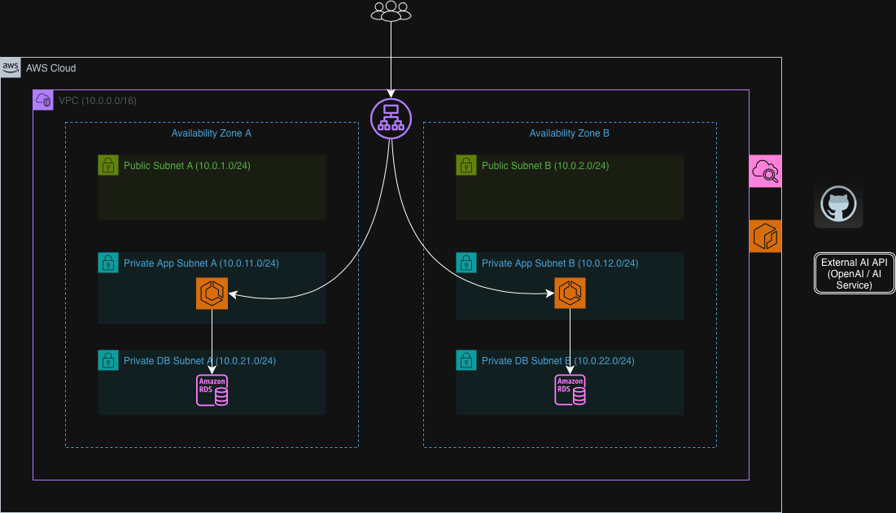

# AI DevOps Log Analyzer

## Project Overview

AI DevOps Log Analyzer is a cloud-native backend service designed to analyze infrastructure and application logs and suggest possible root causes.

The goal of this project is to build a production-style system that helps engineers quickly identify operational issues in distributed environments.

This project evolves step-by-step through a real-world engineering roadmap:

* Local backend service
* Containerized application (Docker)
* Cloud deployment on AWS (ECS Fargate)
* Infrastructure as Code using Terraform
* Monitoring and observability using CloudWatch

---

## Architecture Diagram

This diagram represents the target AWS architecture for the AI DevOps Log Analyzer system.



---

## AWS Deployment Proof

### Application Running (via ALB)


### API Documentation (FastAPI Swagger)


---

### ECS Service Running


### ECS Task (Private Subnet)


---

### Load Balancer + Target Health


---

### Database (RDS - Private)


---

### Network Architecture (Subnets)


### Security Groups


---

## Architecture Overview

* Traffic enters through an **Application Load Balancer** in public subnets.
* The application runs on **ECS Fargate** in private subnets.
* Data is stored in **Amazon RDS PostgreSQL** in private database subnets.
* The service integrates with an **external AI API** for log analysis.
* **CloudWatch** is used for logging, monitoring, and alerts.
* **GitHub Actions + Amazon ECR** enable CI/CD and container deployment.

---

## Tech Stack

### Backend

* Python
* FastAPI

### DevOps / Infrastructure

* Docker (containerization)
* AWS ECS Fargate (container orchestration)
* Amazon RDS PostgreSQL (data persistence)
* Application Load Balancer (traffic routing)
* CloudWatch (logging and monitoring)
* Terraform (infrastructure as code)
* GitHub Actions (CI/CD pipeline)
* Amazon ECR (container registry)

### Tools

* Git
* GitHub
* Linux CLI

---

## API Contract

### GET /health

Returns service health status.

Response:

```json
{"status": "ok"}
```

---

### POST /analyze

Analyzes a log message and returns possible root cause.

Request:

```json
{
  "log": "database timeout"
}
```

Response:

```json
{
  "root_cause": "Service timeout",
  "suggestion": "Check network connectivity or service availability"
}
```

---

## Data Persistence

The application stores analysis results in PostgreSQL.

### Workflow

1. User submits log via UI or API
2. FastAPI processes and analyzes the log
3. Result is stored in PostgreSQL
4. Data can be retrieved via API

### Example

```
GET /results/1
```

---

## Local Development Setup

### 1. Create Virtual Environment

```bash
python3 -m venv .venv
```

### 2. Activate Virtual Environment

Mac / Linux:

```bash
source .venv/bin/activate
```

Windows:

```bash
.venv\Scripts\activate
```

### 3. Install Dependencies

```bash
pip install -r app/requirements.txt
```

### 4. Run the Application

```bash
uvicorn app.main:app --reload
```

### 5. Test the API

* http://127.0.0.1:8000/docs
* http://127.0.0.1:8000/health

---

## Current Progress

* Backend API implemented using FastAPI
* Health check endpoint created
* Log analysis endpoint implemented
* PostgreSQL integration completed
* Local development environment configured

---

## Roadmap

### Phase A (Current Focus)

* Backend service development
* Docker containerization
* Local database integration

### Upcoming Phases

* AWS infrastructure setup (VPC, subnets, ECS, RDS)
* Terraform infrastructure automation
* CI/CD pipeline using GitHub Actions
* CloudWatch monitoring and alerting
* Production-ready deployment

---

## Deployment Plan

### Local Development

Run the API locally:

```bash
uvicorn app.main:app --reload
```

Access API docs:

* http://127.0.0.1:8000/docs

---

### Cloud Deployment (Planned)

* Docker image build and push to Amazon ECR
* ECS Fargate deployment behind Application Load Balancer
* PostgreSQL hosted on Amazon RDS
* Infrastructure provisioning using Terraform
* CI/CD pipeline using GitHub Actions
* Monitoring using CloudWatch

---

## Project Goal

This project is designed to demonstrate real-world cloud engineering and DevOps practices, including:

* Designing scalable AWS architectures
* Containerizing and deploying applications
* Automating infrastructure with Terraform
* Implementing CI/CD pipelines
* Building observable and reliable systems
